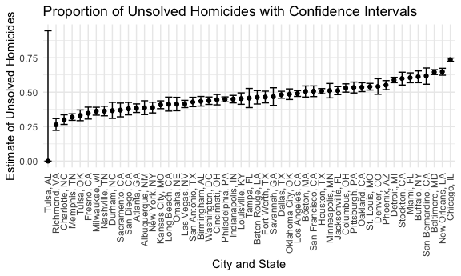
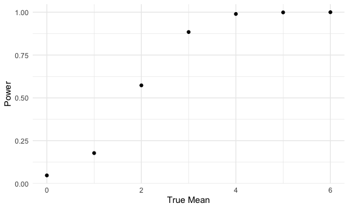
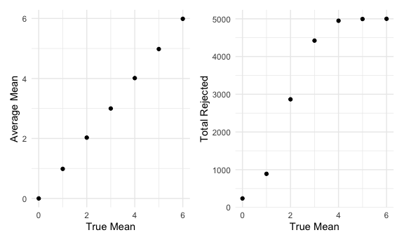

Homework 5
================

### Problem 1

The code chunk below imports the data in individual spreadsheets
contained in `./data/zip_data/`. To do this, I create a dataframe that
includes the list of all files in that directory and the complete path
to each file. As a next step, I `map` over paths and import data using
the `read_csv` function. Finally, I `unnest` the result of `map`.

``` r
full_df = 
  tibble(
    files = list.files("data/zip_data/"),
    path = str_c("data/zip_data/", files)
  ) %>% 
  mutate(data = map(path, read_csv)) %>% 
  unnest()
```

    ## Rows: 1 Columns: 8
    ## ── Column specification ────────────────────────────────────────────────────────
    ## Delimiter: ","
    ## dbl (8): week_1, week_2, week_3, week_4, week_5, week_6, week_7, week_8
    ## 
    ## ℹ Use `spec()` to retrieve the full column specification for this data.
    ## ℹ Specify the column types or set `show_col_types = FALSE` to quiet this message.
    ## Rows: 1 Columns: 8
    ## ── Column specification ────────────────────────────────────────────────────────
    ## Delimiter: ","
    ## dbl (8): week_1, week_2, week_3, week_4, week_5, week_6, week_7, week_8
    ## 
    ## ℹ Use `spec()` to retrieve the full column specification for this data.
    ## ℹ Specify the column types or set `show_col_types = FALSE` to quiet this message.
    ## Rows: 1 Columns: 8
    ## ── Column specification ────────────────────────────────────────────────────────
    ## Delimiter: ","
    ## dbl (8): week_1, week_2, week_3, week_4, week_5, week_6, week_7, week_8
    ## 
    ## ℹ Use `spec()` to retrieve the full column specification for this data.
    ## ℹ Specify the column types or set `show_col_types = FALSE` to quiet this message.
    ## Rows: 1 Columns: 8
    ## ── Column specification ────────────────────────────────────────────────────────
    ## Delimiter: ","
    ## dbl (8): week_1, week_2, week_3, week_4, week_5, week_6, week_7, week_8
    ## 
    ## ℹ Use `spec()` to retrieve the full column specification for this data.
    ## ℹ Specify the column types or set `show_col_types = FALSE` to quiet this message.
    ## Rows: 1 Columns: 8
    ## ── Column specification ────────────────────────────────────────────────────────
    ## Delimiter: ","
    ## dbl (8): week_1, week_2, week_3, week_4, week_5, week_6, week_7, week_8
    ## 
    ## ℹ Use `spec()` to retrieve the full column specification for this data.
    ## ℹ Specify the column types or set `show_col_types = FALSE` to quiet this message.
    ## Rows: 1 Columns: 8
    ## ── Column specification ────────────────────────────────────────────────────────
    ## Delimiter: ","
    ## dbl (8): week_1, week_2, week_3, week_4, week_5, week_6, week_7, week_8
    ## 
    ## ℹ Use `spec()` to retrieve the full column specification for this data.
    ## ℹ Specify the column types or set `show_col_types = FALSE` to quiet this message.
    ## Rows: 1 Columns: 8
    ## ── Column specification ────────────────────────────────────────────────────────
    ## Delimiter: ","
    ## dbl (8): week_1, week_2, week_3, week_4, week_5, week_6, week_7, week_8
    ## 
    ## ℹ Use `spec()` to retrieve the full column specification for this data.
    ## ℹ Specify the column types or set `show_col_types = FALSE` to quiet this message.
    ## Rows: 1 Columns: 8
    ## ── Column specification ────────────────────────────────────────────────────────
    ## Delimiter: ","
    ## dbl (8): week_1, week_2, week_3, week_4, week_5, week_6, week_7, week_8
    ## 
    ## ℹ Use `spec()` to retrieve the full column specification for this data.
    ## ℹ Specify the column types or set `show_col_types = FALSE` to quiet this message.
    ## Rows: 1 Columns: 8
    ## ── Column specification ────────────────────────────────────────────────────────
    ## Delimiter: ","
    ## dbl (8): week_1, week_2, week_3, week_4, week_5, week_6, week_7, week_8
    ## 
    ## ℹ Use `spec()` to retrieve the full column specification for this data.
    ## ℹ Specify the column types or set `show_col_types = FALSE` to quiet this message.
    ## Rows: 1 Columns: 8
    ## ── Column specification ────────────────────────────────────────────────────────
    ## Delimiter: ","
    ## dbl (8): week_1, week_2, week_3, week_4, week_5, week_6, week_7, week_8
    ## 
    ## ℹ Use `spec()` to retrieve the full column specification for this data.
    ## ℹ Specify the column types or set `show_col_types = FALSE` to quiet this message.
    ## Rows: 1 Columns: 8
    ## ── Column specification ────────────────────────────────────────────────────────
    ## Delimiter: ","
    ## dbl (8): week_1, week_2, week_3, week_4, week_5, week_6, week_7, week_8
    ## 
    ## ℹ Use `spec()` to retrieve the full column specification for this data.
    ## ℹ Specify the column types or set `show_col_types = FALSE` to quiet this message.
    ## Rows: 1 Columns: 8
    ## ── Column specification ────────────────────────────────────────────────────────
    ## Delimiter: ","
    ## dbl (8): week_1, week_2, week_3, week_4, week_5, week_6, week_7, week_8
    ## 
    ## ℹ Use `spec()` to retrieve the full column specification for this data.
    ## ℹ Specify the column types or set `show_col_types = FALSE` to quiet this message.
    ## Rows: 1 Columns: 8
    ## ── Column specification ────────────────────────────────────────────────────────
    ## Delimiter: ","
    ## dbl (8): week_1, week_2, week_3, week_4, week_5, week_6, week_7, week_8
    ## 
    ## ℹ Use `spec()` to retrieve the full column specification for this data.
    ## ℹ Specify the column types or set `show_col_types = FALSE` to quiet this message.
    ## Rows: 1 Columns: 8
    ## ── Column specification ────────────────────────────────────────────────────────
    ## Delimiter: ","
    ## dbl (8): week_1, week_2, week_3, week_4, week_5, week_6, week_7, week_8
    ## 
    ## ℹ Use `spec()` to retrieve the full column specification for this data.
    ## ℹ Specify the column types or set `show_col_types = FALSE` to quiet this message.
    ## Rows: 1 Columns: 8
    ## ── Column specification ────────────────────────────────────────────────────────
    ## Delimiter: ","
    ## dbl (8): week_1, week_2, week_3, week_4, week_5, week_6, week_7, week_8
    ## 
    ## ℹ Use `spec()` to retrieve the full column specification for this data.
    ## ℹ Specify the column types or set `show_col_types = FALSE` to quiet this message.
    ## Rows: 1 Columns: 8
    ## ── Column specification ────────────────────────────────────────────────────────
    ## Delimiter: ","
    ## dbl (8): week_1, week_2, week_3, week_4, week_5, week_6, week_7, week_8
    ## 
    ## ℹ Use `spec()` to retrieve the full column specification for this data.
    ## ℹ Specify the column types or set `show_col_types = FALSE` to quiet this message.
    ## Rows: 1 Columns: 8
    ## ── Column specification ────────────────────────────────────────────────────────
    ## Delimiter: ","
    ## dbl (8): week_1, week_2, week_3, week_4, week_5, week_6, week_7, week_8
    ## 
    ## ℹ Use `spec()` to retrieve the full column specification for this data.
    ## ℹ Specify the column types or set `show_col_types = FALSE` to quiet this message.
    ## Rows: 1 Columns: 8
    ## ── Column specification ────────────────────────────────────────────────────────
    ## Delimiter: ","
    ## dbl (8): week_1, week_2, week_3, week_4, week_5, week_6, week_7, week_8
    ## 
    ## ℹ Use `spec()` to retrieve the full column specification for this data.
    ## ℹ Specify the column types or set `show_col_types = FALSE` to quiet this message.
    ## Rows: 1 Columns: 8
    ## ── Column specification ────────────────────────────────────────────────────────
    ## Delimiter: ","
    ## dbl (8): week_1, week_2, week_3, week_4, week_5, week_6, week_7, week_8
    ## 
    ## ℹ Use `spec()` to retrieve the full column specification for this data.
    ## ℹ Specify the column types or set `show_col_types = FALSE` to quiet this message.
    ## Rows: 1 Columns: 8
    ## ── Column specification ────────────────────────────────────────────────────────
    ## Delimiter: ","
    ## dbl (8): week_1, week_2, week_3, week_4, week_5, week_6, week_7, week_8
    ## 
    ## ℹ Use `spec()` to retrieve the full column specification for this data.
    ## ℹ Specify the column types or set `show_col_types = FALSE` to quiet this message.

The result of the previous code chunk isn’t tidy – data are wide rather
than long, and some important variables are included as parts of others.
The code chunk below tides the data using string manipulations on the
file, converting from wide to long, and selecting relevant variables.

``` r
tidy_df = 
  full_df %>% 
  mutate(
    files = str_replace(files, ".csv", ""),
    group = str_sub(files, 1, 3)) %>% 
  pivot_longer(
    week_1:week_8,
    names_to = "week",
    values_to = "outcome",
    names_prefix = "week_") %>% 
  mutate(week = as.numeric(week)) %>% 
  select(group, subj = files, week, outcome)
```

Finally, the code chunk below creates a plot showing individual data,
faceted by group.

``` r
tidy_df %>% 
  ggplot(aes(x = week, y = outcome, group = subj, color = group)) + 
  geom_point() + 
  geom_path() + 
  facet_grid(~group)
```


This plot suggests high within-subject correlation – subjects who start
above average end up above average, and those that start below average
end up below average. Subjects in the control group generally don’t
change over time, but those in the experiment group increase their
outcome in a roughly linear way.

### Problem 2

Describe the raw data. Create a city_state variable (e.g. “Baltimore,
MD”) and then summarize within cities to obtain the total number of
homicides and the number of unsolved homicides (those for which the
disposition is “Closed without arrest” or “Open/No arrest”).

``` r
homicide_df <- 
  read_csv("homicide-data.csv", na = c("", "Unknown")) %>% 
  mutate(city_state = str_c(city, ", ", state),
         resolution = case_when(
           disposition == "Closed without arrest" ~ "unsolved",
           disposition == "Open/No arrest" ~ "unsolved",
           disposition == "Closed by arrest" ~ "solved"
         )) %>% 
  relocate(uid, reported_date, city_state)
```

    ## Rows: 52179 Columns: 12
    ## ── Column specification ────────────────────────────────────────────────────────
    ## Delimiter: ","
    ## chr (8): uid, victim_last, victim_first, victim_race, victim_sex, city, stat...
    ## dbl (4): reported_date, victim_age, lat, lon
    ## 
    ## ℹ Use `spec()` to retrieve the full column specification for this data.
    ## ℹ Specify the column types or set `show_col_types = FALSE` to quiet this message.

``` r
  homicide_df %>% 
    group_by(disposition,city) %>% 
  count() %>% 
    knitr::kable()
```

| disposition           | city           |    n |
|:----------------------|:---------------|-----:|
| Closed by arrest      | Albuquerque    |  232 |
| Closed by arrest      | Atlanta        |  600 |
| Closed by arrest      | Baltimore      | 1002 |
| Closed by arrest      | Baton Rouge    |  228 |
| Closed by arrest      | Birmingham     |  453 |
| Closed by arrest      | Boston         |  304 |
| Closed by arrest      | Buffalo        |  202 |
| Closed by arrest      | Charlotte      |  481 |
| Closed by arrest      | Chicago        | 1462 |
| Closed by arrest      | Cincinnati     |  385 |
| Closed by arrest      | Columbus       |  509 |
| Closed by arrest      | Dallas         |  813 |
| Closed by arrest      | Denver         |  143 |
| Closed by arrest      | Detroit        | 1037 |
| Closed by arrest      | Durham         |  175 |
| Closed by arrest      | Fort Worth     |  294 |
| Closed by arrest      | Fresno         |  318 |
| Closed by arrest      | Houston        | 1449 |
| Closed by arrest      | Indianapolis   |  728 |
| Closed by arrest      | Jacksonville   |  571 |
| Closed by arrest      | Kansas City    |  704 |
| Closed by arrest      | Las Vegas      |  809 |
| Closed by arrest      | Long Beach     |  222 |
| Closed by arrest      | Los Angeles    | 1151 |
| Closed by arrest      | Louisville     |  315 |
| Closed by arrest      | Memphis        | 1031 |
| Closed by arrest      | Miami          |  294 |
| Closed by arrest      | Milwaukee      |  712 |
| Closed by arrest      | Minneapolis    |  179 |
| Closed by arrest      | Nashville      |  489 |
| Closed by arrest      | New Orleans    |  504 |
| Closed by arrest      | New York       |  384 |
| Closed by arrest      | Oakland        |  439 |
| Closed by arrest      | Oklahoma City  |  346 |
| Closed by arrest      | Omaha          |  240 |
| Closed by arrest      | Philadelphia   | 1677 |
| Closed by arrest      | Phoenix        |  410 |
| Closed by arrest      | Pittsburgh     |  294 |
| Closed by arrest      | Richmond       |  316 |
| Closed by arrest      | Sacramento     |  237 |
| Closed by arrest      | San Antonio    |  476 |
| Closed by arrest      | San Bernardino |  105 |
| Closed by arrest      | San Diego      |  286 |
| Closed by arrest      | San Francisco  |  327 |
| Closed by arrest      | Savannah       |  131 |
| Closed by arrest      | St. Louis      |  772 |
| Closed by arrest      | Stockton       |  178 |
| Closed by arrest      | Tampa          |  113 |
| Closed by arrest      | Tulsa          |  391 |
| Closed by arrest      | Washington     |  756 |
| Closed without arrest | Albuquerque    |   52 |
| Closed without arrest | Atlanta        |   58 |
| Closed without arrest | Baltimore      |  152 |
| Closed without arrest | Baton Rouge    |   16 |
| Closed without arrest | Birmingham     |   64 |
| Closed without arrest | Buffalo        |    8 |
| Closed without arrest | Charlotte      |   44 |
| Closed without arrest | Chicago        |  387 |
| Closed without arrest | Cincinnati     |   49 |
| Closed without arrest | Columbus       |   80 |
| Closed without arrest | Dallas         |   78 |
| Closed without arrest | Denver         |   46 |
| Closed without arrest | Detroit        |   16 |
| Closed without arrest | Durham         |   11 |
| Closed without arrest | Fort Worth     |   35 |
| Closed without arrest | Fresno         |   23 |
| Closed without arrest | Houston        |  346 |
| Closed without arrest | Indianapolis   |  102 |
| Closed without arrest | Jacksonville   |  141 |
| Closed without arrest | Kansas City    |   36 |
| Closed without arrest | Las Vegas      |  175 |
| Closed without arrest | Long Beach     |   27 |
| Closed without arrest | Memphis        |   50 |
| Closed without arrest | Miami          |   63 |
| Closed without arrest | Milwaukee      |   37 |
| Closed without arrest | Minneapolis    |   31 |
| Closed without arrest | Nashville      |   57 |
| Closed without arrest | New Orleans    |   98 |
| Closed without arrest | New York       |   17 |
| Closed without arrest | Oklahoma City  |   11 |
| Closed without arrest | Omaha          |   10 |
| Closed without arrest | Philadelphia   |   92 |
| Closed without arrest | Phoenix        |   96 |
| Closed without arrest | Richmond       |   20 |
| Closed without arrest | Sacramento     |   23 |
| Closed without arrest | San Antonio    |   87 |
| Closed without arrest | San Bernardino |   19 |
| Closed without arrest | San Diego      |   64 |
| Closed without arrest | San Francisco  |    1 |
| Closed without arrest | Savannah       |   12 |
| Closed without arrest | St. Louis      |   40 |
| Closed without arrest | Stockton       |   11 |
| Closed without arrest | Tampa          |    8 |
| Closed without arrest | Tulsa          |   55 |
| Closed without arrest | Washington     |   74 |
| Open/No arrest        | Albuquerque    |   94 |
| Open/No arrest        | Atlanta        |  315 |
| Open/No arrest        | Baltimore      | 1673 |
| Open/No arrest        | Baton Rouge    |  180 |
| Open/No arrest        | Birmingham     |  283 |
| Open/No arrest        | Boston         |  310 |
| Open/No arrest        | Buffalo        |  311 |
| Open/No arrest        | Charlotte      |  162 |
| Open/No arrest        | Chicago        | 3686 |
| Open/No arrest        | Cincinnati     |  260 |
| Open/No arrest        | Columbus       |  495 |
| Open/No arrest        | Dallas         |  676 |
| Open/No arrest        | Denver         |  123 |
| Open/No arrest        | Detroit        | 1466 |
| Open/No arrest        | Durham         |   90 |
| Open/No arrest        | Fort Worth     |  220 |
| Open/No arrest        | Fresno         |  146 |
| Open/No arrest        | Houston        | 1147 |
| Open/No arrest        | Indianapolis   |  492 |
| Open/No arrest        | Jacksonville   |  456 |
| Open/No arrest        | Kansas City    |  450 |
| Open/No arrest        | Las Vegas      |  397 |
| Open/No arrest        | Long Beach     |  129 |
| Open/No arrest        | Los Angeles    | 1106 |
| Open/No arrest        | Louisville     |  261 |
| Open/No arrest        | Memphis        |  433 |
| Open/No arrest        | Miami          |  387 |
| Open/No arrest        | Milwaukee      |  366 |
| Open/No arrest        | Minneapolis    |  156 |
| Open/No arrest        | Nashville      |  221 |
| Open/No arrest        | New Orleans    |  832 |
| Open/No arrest        | New York       |  226 |
| Open/No arrest        | Oakland        |  508 |
| Open/No arrest        | Oklahoma City  |  315 |
| Open/No arrest        | Omaha          |  159 |
| Open/No arrest        | Philadelphia   | 1268 |
| Open/No arrest        | Phoenix        |  408 |
| Open/No arrest        | Pittsburgh     |  337 |
| Open/No arrest        | Richmond       |   93 |
| Open/No arrest        | Sacramento     |  116 |
| Open/No arrest        | San Antonio    |  270 |
| Open/No arrest        | San Bernardino |  151 |
| Open/No arrest        | San Diego      |  111 |
| Open/No arrest        | San Francisco  |  335 |
| Open/No arrest        | Savannah       |  103 |
| Open/No arrest        | St. Louis      |  865 |
| Open/No arrest        | Stockton       |  255 |
| Open/No arrest        | Tampa          |   87 |
| Open/No arrest        | Tulsa          |  138 |
| Open/No arrest        | Washington     |  515 |

The raw data set has 52179 rows and 14 columns and include variables
such as uid, reported date, victim lastname, victim firstname, victim
race, victim age, victim sex, city and state.

Here we focus on Baltimore, MD to estimate the proportion of homicides
that are unsolved as well as the confidence intervals.

``` r
baltimore_summary <- 
 homicide_df %>% 
  filter(city_state == "Baltimore, MD") %>% 
  summarize(
    unsolved = sum(resolution == "unsolved"),
    n = n()
  )

baltimore_test <- 
  prop.test(
    x = baltimore_summary$unsolved,
    n = baltimore_summary$n) 

baltimore_test %>% 
  broom::tidy() %>% 
  select(estimate, starts_with("conf")) %>% 
  knitr::kable()
```

|  estimate |  conf.low | conf.high |
|----------:|----------:|----------:|
| 0.6455607 | 0.6275625 | 0.6631599 |

The estimated proportion is 0.6455 and the lower and upper confidence
intervals are 0.628 and 0.663.

Next, we create a function for the proportions of unsolved homicides and
the confidence intervals.

``` r
prop_test_function = function(city_df) {
  city_summary =
    city_df %>%
    summarize(
      unsolved = sum(resolution == "unsolved"),
      n = n()
    )
  
  city_test =
    prop.test(
      x = city_summary %>% pull(unsolved),
      n = city_summary %>% pull(n))
  
  return(city_test)
}
```

``` r
#iterate across all cities
results_df =
  homicide_df %>%
  nest(data = -city_state) %>%
  mutate(
    test_results = map(data, prop_test_function),
    tidy_results = map(test_results, broom::tidy)
  ) %>%
  select(city_state, tidy_results) %>%
  unnest(tidy_results) %>%
  select(city_state, estimate, starts_with("conf"))
results_df
```

    ## # A tibble: 51 × 4
    ##    city_state      estimate conf.low conf.high
    ##    <chr>              <dbl>    <dbl>     <dbl>
    ##  1 Albuquerque, NM    0.386    0.337     0.438
    ##  2 Atlanta, GA        0.383    0.353     0.415
    ##  3 Baltimore, MD      0.646    0.628     0.663
    ##  4 Baton Rouge, LA    0.462    0.414     0.511
    ##  5 Birmingham, AL     0.434    0.399     0.469
    ##  6 Boston, MA         0.505    0.465     0.545
    ##  7 Buffalo, NY        0.612    0.569     0.654
    ##  8 Charlotte, NC      0.300    0.266     0.336
    ##  9 Chicago, IL        0.736    0.724     0.747
    ## 10 Cincinnati, OH     0.445    0.408     0.483
    ## # … with 41 more rows

I’ll now create a plot that shows the estimates and confidence intervals
for each city

``` r
results_df %>%
  mutate(city_state = fct_reorder(city_state, estimate)) %>%
  ggplot(aes(x = city_state, y = estimate)) +
  geom_point() +
  geom_errorbar(aes(ymin = conf.low, ymax = conf.high)) + 
  theme(axis.text.x = element_text(angle = 90, vjust = .5, hjust = 1)) +
  labs(title = "Proportion of Unsolved Homicides with Confidence Intervals", 
       x = "City and State",
       y = "Estimate of Unsolved Homicides")
```


From the plot above we see that Tulsa, AK has the lowest proportion of
unsolved homicides but has the largest confidence intervals and Chicago,
Il has the highest proportion of unsolved homicides with very small
confidence intervals. Most of the other cities have reasonable
confidence intervals.

### Problem 3

Generate 5000 datasets from the model with the following design
elements: Fix n=30 Fix σ=5 Set μ=0

``` r
set.seed(0)

t_test_clean <- function(df) {
 out_df <- t.test(df,
         alternative = c("two.sided"),
         mu = 0,
         conf.level = 0.95) %>% 
    broom::tidy()
 return(out_df)
}


generate_results <- function(mu = 0, 
                             sigma=5,
                             n_iter=5000,
                             n_obs =30){

new_list <- list()


for (i in 1:n_iter) {
  temp_vec <- rnorm( n = n_obs, mean = mu, sd = sigma)
  new_list[[i]] <-temp_vec
}

stat_tib<-
  tibble(
  data = new_list
) %>% 
  mutate(
    t_test_res = map(.x = data, ~t_test_clean(.x))
  ) %>% 
  unnest(t_test_res) %>% 
 janitor::clean_names() %>% 
  select(estimate,p_value)

fin_tib <- stat_tib %>% 
  mutate(
    rej = p_value < 0.05
  ) %>% 
  summarise(
    total = n(),
    total_rej = sum(rej),
    prop_rej = total_rej/total,
    avg_mu_hat = mean(estimate)
    )
return(fin_tib)
}

mu_tib <-
  tibble(
    mu = c(0, 1, 2, 3, 4, 5, 6)
  ) %>% 
  mutate(
    results = map(.x = mu, ~generate_results(mu = .x))
  ) %>% 
  unnest(results)
```

Make a plot showing the proportion of times the null was rejected (the
power of the test) on the y axis and the true value of μ on the x axis.
Describe the association between effect size and power.

``` r
mu_tib %>% 
  ggplot(aes(x = mu, y = prop_rej))+
  geom_point() + 
  xlab("True Mean") +
  ylab("Power")
```



Make a plot showing the average estimate of μ̂ on the y axis and the true
value of μ on the x axis. Make a second plot (or overlay on the first)
the average estimate of μ̂ only in samples for which the null was
rejected on the y axis and the true value of μ on the x axis.

``` r
p <- mu_tib %>% 
  ggplot(aes(x = mu, y = avg_mu_hat))+
  geom_point() + 
  xlab("True Mean") +
  ylab("Average Mean")

q <- mu_tib %>% 
  ggplot(aes(x = mu, y = total_rej))+
  geom_point() +
  xlab("True Mean") +
  ylab("Total Rejected")
  
  p + q
```



Is the sample average of μ̂ across tests for which the null is rejected
approximately equal to the true value of μ ? Why or why not?

Power is increaisng as true mean increases
